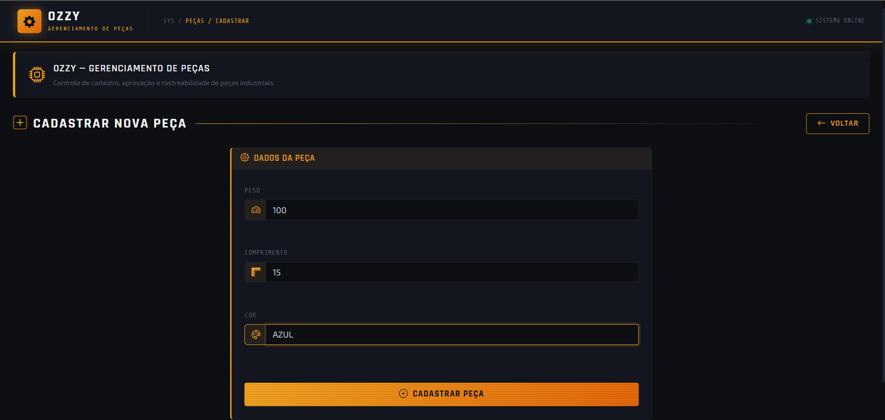
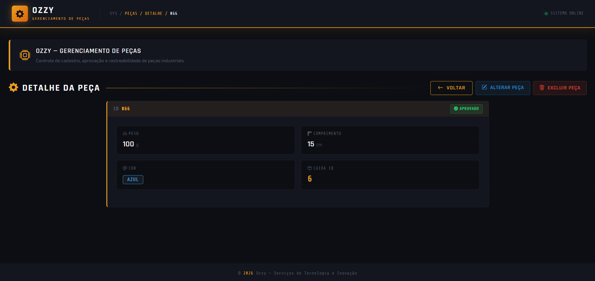
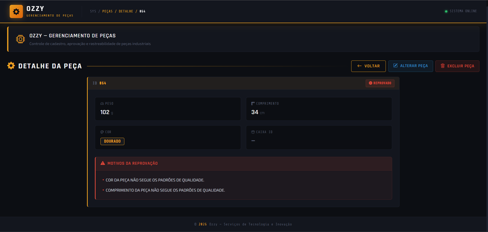

# 🧩 Ozzy - Gerenciamento de Peças

Sistema web desenvolvido em Python com Flask para gerenciamento e controle de qualidade de peças industriais.

---

## 📌 Funcionalidades

* Cadastro de peças
* Validação automática de qualidade
* Classificação (Aprovado / Reprovado)
* Gerenciamento de caixas (abertas/fechadas)
* Alteração e remoção de peças
* Listagem de peças e caixas
* Relatório geral

---

## ⚙️ Regras de Negócio

Uma peça é **APROVADA** quando:

* Peso entre **95g e 105g**
* Cor **azul ou verde**
* Comprimento entre **10cm e 20cm**

Caso contrário, a peça é **REPROVADA** com os motivos registrados.

---

## 📦 Organização de Caixas

* Cada caixa comporta até **10 peças aprovadas**
* Ao atingir o limite → caixa é **fechada**
* Novas peças vão para a próxima caixa aberta
* Alterações/remover peças atualizam automaticamente as caixas

---

## 🗂️ Estrutura do Projeto

```
README.md
app/

app/
├── app.py
├── bd.db
├── requirements.txt
├── operacoes/
├── templates/
└── utilitarios/
```

---

## ▶️ Como Executar o Projeto

### 1. Clonar o repositório

```
git clone <url-do-repositorio>
cd projeto
cd app
```

### 2. Criar ambiente virtual

```
python -m venv venv
```

### 3. Ativar ambiente virtual

**Windows:**

```
.venv/Scripts/activate
```

**Linux/Mac:**

```
source venv/bin/activate
```

### 4. Instalar dependências

```
pip install -r app/requirements.txt
```

### 5. Executar aplicação

```
flask --app app run

```

### 6. Acessar no navegador

```
http://localhost:5000
```

---

## 🔄 Fluxo de Funcionamento

1. Usuário cadastra uma peça
2. Sistema valida automaticamente
3. Se aprovada:

   * Peça é alocada em uma caixa
4. Se reprovada:

   * Motivos são registrados
5. Sistema mantém controle das caixas automaticamente

---

## 📥 Exemplo de Entrada (JSON)

```json
{
  "peso": 100,
  "cor_id": 4,
  "comprimento": 15
}
```

>

---

## 📤 Exemplo de Saída

### Peça Aprovada

```json
{
  "id": 66,
  "peso": 100,
  "cor_id": 4,
  "comprimento": 15,
  "status": "APROVADO",
  "caixa_id": 2,
  "motivos_reprovacao": []
}
```

>

### Peça Reprovada

```json
{
  "id": 64,
  "peso": 102,
  "cor_id": 12,
  "comprimento": 34,
  "status": "REPROVADO",
  "caixa_id": null,
  "motivos_reprovacao": [
    "COR DA PEÇA NÃO SEGUE OS PADRÕES DE QUALIDADE.",
    "COMPRIMENTO DA PEÇA NÃO SEGUE OS PADRÕES DE QUALIDADE."
  ]
}
```

>

---

## 🧪 Dados de Teste

O sistema já inicializa com uma massa de dados para testes:

* Peças aprovadas
* Peças reprovadas
* Cores cadastradas automaticamente

---

## 🛠️ Tecnologias Utilizadas

* Python
* Flask
* SQLite
* HTML (templates)

---

## 🚀 Possíveis Melhorias

* API REST completa
* Autenticação de usuários
* Dashboard com gráficos
* Flexibilizar como critérios de aprovação das peças são definidos/salvos
* Integração com sensores industriais
* Uso de IA para inspeção visual

---

## Artefatos

* [Vídeo de Demonstração](https://drive.google.com/file/d/1PQVZ49eBXwEuGefnYrOtuSRycTGoRXLF/view?usp=sharing)
* [Documentação e Discussões](./documentacao/analises_discussões.pdf)

---

## 📄 Licença

Projeto acadêmico / experimental.

---
