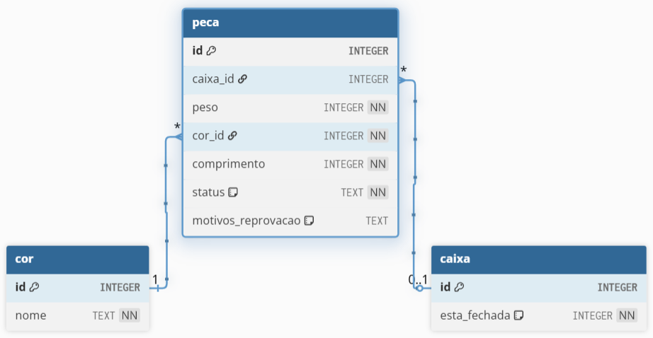

# Ozzy - Gerenciamento de Peças

## Documento de Análise e Discussões

---

## 1. Introdução

O sistema **Ozzy - Gerenciamento de Peças** foi idealizado para resolver problemas recorrentes em processos industriais relacionados ao controle de qualidade e armazenamento de peças produzidas em linha de montagem.

Atualmente, o processo manual de inspeção apresenta limitações significativas:

* Alto risco de falhas humanas
* Baixa rastreabilidade
* Lentidão na validação
* Custos operacionais elevados

Diante disso, o Ozzy surge como uma solução automatizada capaz de:

* Validar peças automaticamente
* Classificar peças em aprovadas ou reprovadas
* Gerenciar o armazenamento em caixas
* Garantir consistência nos critérios de qualidade

---

## 2. Importância da Automação na Indústria

A automação na indústria é algo em constante evolução seja qual for a área aplicada. Se um processo possui etapas manuais e/ou repetitivas para a execução de uma tarefa, isso estabele um padrão de comportamento, que por sua vez é passível de automação. A automatização de processos aplicados não aos vários setores da indústria, podem trazer vantagens como agilidade e aumento de lucros para uma empresa. Além disso, tende a reduzir os riscos de erros humanos e a carga de trabalho de colaboradores.

Automatizar tarefas também apresenta algumas desvantagens como aumento nos custos de criação e manutenção de recursos que mantém tal automatização em execução, encontrar colaborares capacitados com conhecimentos específicos para ajudar com situações como problemas técnicos relacionados a automação, entre outros. Apesar de tais consequências, as vantagens tendem a superar as desvantagens quando se há sistemas automizados acelerando a produtitividade de uma empresa, tornando operações mais econômicas, à prova de erros e visíveis, eliminando a necessidade de fluxos de trabalho redundantes e ineficientes. 

Dentro desse contexto, trazemos a solução Ozzy - Gerencimento de Peças, que oferece cadastro, processamento e avaliação de peças de uma linha de montagem. O processo de avaliação e aprovação de peças, antes manual, agora pode ser feito de forma automática através do sistema, o qual recebe informações de uma peça e com base em critérios definidos pelo cliente, uma peça pode ser aprovada e automaticamente encaixada. Além de oferecer um espaço para administrar peças cadastradas, as caixas que foram fechadas e abertas, peças que não foram aprovadas e leitura de relatórios.

---

## 3. Modelagem e Estrutura Lógica do Sistema

A construção do sistema foi baseada em uma separação clara de responsabilidades:

### 3.1 Estrutura de Raciocínio

O sistema foi organizado em três pilares principais:

#### 🔹 Validação (Regras de Negócio)

A função `validar_peca` aplica regras de qualidade:

* Peso entre 95g e 105g
* Cor deve ser azul ou verde
* Comprimento entre 10cm e 20cm

Caso alguma regra não seja atendida:

* A peça é marcada como **REPROVADA**
* Os motivos são armazenados

Caso contrário:

* A peça é marcada como **APROVADA**

---

#### 🔹 Decisão (Fluxo Condicional)

A aplicação utiliza estruturas condicionais (`if/else`) para:

* Determinar o status da peça
* Definir se a peça será alocada em caixa
* Atualizar status de caixas automaticamente

---

#### 🔹 Repetição (Iterações)

Estruturas de repetição são utilizadas para:

* Paginação de dados
* Listagem de peças e caixas
* Verificação de status das caixas

---

#### 🔹 Persistência

O sistema utiliza **SQLite** com três entidades principais:

* **Peça**
* **Caixa**
* **Cor**

---

### 3.2 Modelo do Banco de Dados

Abaixo está uma representação conceitual baseada no script SQL:

```
[COR]
 id (PK)
 nome

[CAIXA]
 id (PK)
 esta_fechada (boolean)

[PECA]
 id (PK)
 peso
 comprimento
 status
 motivos_reprovacao
 cor_id (FK)
 caixa_id (FK)
```

### 🖼️ Diagrama do Banco de Dados

A imagem abaixo representa o relacionamento entre as entidades do sistema:

>

---

## 4. Regras de Negócio Implementadas

O sistema possui regras dinâmicas importantes:

### ✔ Cadastro de Peças

* Validação automática
* Alocação automática em caixas (se aprovada)

### ✔ Alteração de Peças

* Revalidação completa
* Atualização automática de caixas

### ✔ Remoção de Peças

* Atualiza automaticamente o status da caixa

### ✔ Gerenciamento de Caixas

* Capacidade máxima: 10 peças
* Caixa fecha automaticamente ao atingir limite
* Caixa reabre automaticamente se perder peças

---

## 5. Benefícios da Solução

A implementação do Ozzy traz diversos ganhos:

### 🚀 Operacionais

* Redução de erros humanos
* Padronização da inspeção
* Maior velocidade no processo

### 📊 Gerenciais

* Melhor rastreabilidade
* Dados estruturados para análise
* Relatórios automáticos

### 🧠 Técnicos

* Código modular e reutilizável
* Separação clara entre regras e persistência
* Fácil manutenção e expansão

---

## 6. Desafios Enfrentados

Durante o desenvolvimento, alguns desafios relevantes foram identificados:

* Sincronização entre peças e caixas
* Garantia de consistência após alterações
* Controle automático de status de caixas
* Persistência de listas (motivos de reprovação) em formato JSON

---

## 7. Reflexão e Evolução do Sistema

Este protótipo pode evoluir significativamente para um cenário industrial real:

### 🔌 Integração com Hardware

* Sensores de peso e dimensão
* Leitura automática via IoT

### 🤖 Inteligência Artificial

* Detecção de defeitos visuais
* Aprendizado de padrões de falha

### 🏭 Integração Industrial

* Conexão com sistemas ERP
* Monitoramento em tempo real
* Dashboards operacionais

### ☁️ Escalabilidade

* Migração para banco de dados robusto (PostgreSQL)
* API REST completa
* Deploy em nuvem

---

## 8. Conclusão

O Ozzy demonstra como uma solução relativamente simples em Python pode resolver problemas reais de indústria, trazendo eficiência, confiabilidade e base para evolução tecnológica futura.

---

## 9. Referências

* [Documentação oficial do Python](https://docs.python.org/3/)
* [Documentação oficial do Flask](https://flask.palletsprojects.com/)
* [Documentação SQLite](https://www.sqlite.org/docs.html)
* [Conheça as vantagens e desvantagens da automação industrial](https://sebrae.com.br/sites/PortalSebrae/artigos/conheca-as-vantagens-e-desvantagens-da-automacao-industrial,4e6896bdbe056810VgnVCM1000001b00320aRCRD)

---
